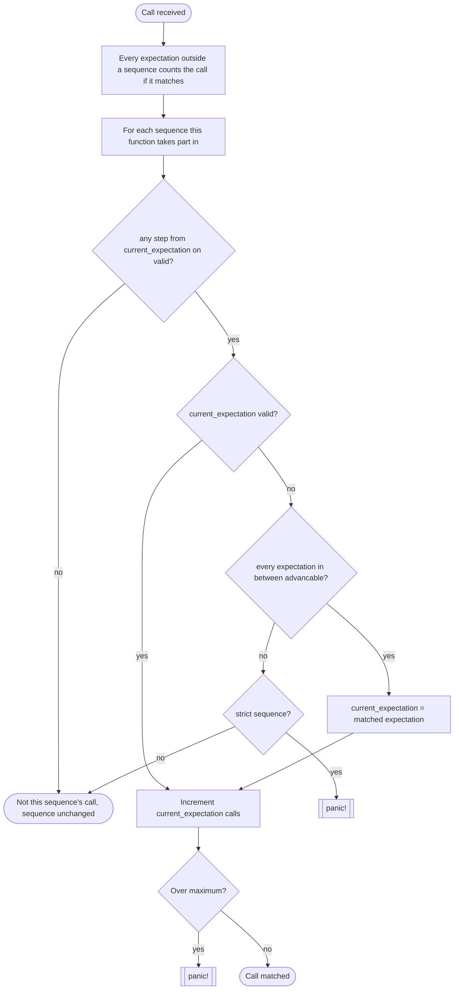

# Expectations

You can set expectations with Spies and Mocks. Here are all the ways to do that.

```rust
// Expect at least one call with (2)
spy.expect(eq(2));
// The same but as a function
spy.expectf(|id: &i32| id == 2);

// Expect (2) exactly three times.
spy.expect(eq(2)).times(3);
// Expect (2) one to three times.
spy.expect(eg(2)).times(1..=3)
// Expect (2) at least one time
spy.expect(eq(2)).times(1..);
// Expect (2) less than three time
spy.expect(eq(2)).times(..3);
// Expect (2) once
spy.expect(eq(2)).once();
// Expect (2) never
spy.expect(eq(2)).never();
```

## Global times

If you want to assert the number of calls independently of the used arguments, you can do that.

```rust
// Expect fetch_user to be called exactly 2 times.
spy.expect_times(2);
// Expect fetch_user to be called once
spy.expect_once();
// Expect fetch_user to be never called
spy.expect_never();
// Expect fetch_user to be called 2 or more times.
spy.expect_times(2..);
```

This is completely seperate from the other expectations and does not affect the sequence.

## No Sequence

```rust
// Expect (2) exactly three times.
spy.expect(eq(2)).times(3);
// Expect (2) one to three times.
spy.expect(eg(5)).times(1..=3)
```

Both expectations set like above would need to be fulfilled independently from each other. So three calls with (2) and one to three with (5).

## Sequences

```rust
let seq = Sequence::new();
// Expect (2) exactly three times.
spy.expect(eq(2)).times(3).in_sequence(&seq);
// And after that (5) one time
spy.expect(eq(5)).once().in_sequence(&seq);
```

Sequences allow you to set a sequence in which the calls need to be made.

```rust
let seq = Sequence::new();
// The sequence can be advanced at any time. No minimum or maximum of calls.
spy.expect(eq(2)).in_sequence(&seq);
// One call with (3) advances the sequence
spy.expect(eq(3)).once().in_sequence(&seq);
// Before the next step there can be no call with (4). Advancable at any time.
spy.expect(eq(4)).never().in_sequence(&seq);
// After one call with (5) advancable. If four or more calls panic.
spy.expect(eq(5)).times(1..4).in_sequence(&seq);
// After two calls with (6) advancable.
spy.expect(eq(6)).times(2..).in_sequence(&seq);
// Advancable at any time. Panics after three calls with (7).
spy.expect(eq(7)).times(..3).in_sequence(&seq);
```

There can be multiple sequences independently from each other.

`in_sequence` may be chained before or after `times`, `once` and `never` — the
sequence reads the call range off the expectation whenever it needs it instead
of taking a copy, so both orders describe the same thing.

```rust
// These two are equivalent.
spy.expect(eq(2)).times(2).in_sequence(&seq);
spy.expect(eq(2)).in_sequence(&seq).times(2);
```

### Across functions

A sequence may hold the expectations of **different** spied functions, which is
the only way to say that one function has to be called before another.

```rust
let seq = Sequence::new();
get_user_spy().expect(eq("a")).once().in_sequence(&seq);
save_user_spy().expect(eq("a")).once().in_sequence(&seq);

// Calling save_user first panics.
```

Each spy only recognises its own expectations, so the steps of the other
function never accept its calls — they can only block it from advancing.

### Calls out of order

A call that arrives too early — one that matches a later step while an earlier
one has not reached its minimum yet — is **not** an error either. The sequence
cannot place it, so it handles it like any other call that does not apply to the
current step: it is not recorded and the sequence stays where it is. The order is
still enforced, only at the assert: the step that was passed over never got its
calls.

```rust
let seq = Sequence::new();
spy.expect(eq(2)).times(3).in_sequence(&seq);
spy.expect(eq(5)).once().in_sequence(&seq);

fetch_user(2);
fetch_user(5); // too early: dropped, the sequence stays on the first step
fetch_user(2);
fetch_user(2);
// spy.assert() fails: the (5) expectation never got its call.
```

Set `strict` on the sequence to have that call panic where it happens instead.
It is the same order, only reported earlier and with the offending call named.

```rust
let seq = Sequence::new().strict();
spy.expect(eq(2)).times(3).in_sequence(&seq);
spy.expect(eq(5)).once().in_sequence(&seq);

fetch_user(2);
fetch_user(5); // panics
```

Strictness only concerns the order of the sequence's own steps. Calls the
sequence has nothing to do with pass a strict sequence just like a lenient one.

### Unexpected calls

A call that no expectation matches is not an error. A spy does not replace the
function, so it has nothing to be strict about: it reports on the expectations
the test set, and stays quiet about the rest.

```rust
let seq = Sequence::new();
spy.expect(eq(2)).once().in_sequence(&seq);
spy.expect(eq(3)).once().in_sequence(&seq);
// Not in the sequence, so it is not ordered: a call with (9) may come at any
// time, and it neither advances the sequence nor counts as out of order.
spy.expect(eq(9)).times(2);

fetch_user(9); // counted by the unsequenced expectation
fetch_user(2); // the sequence's current expectation
fetch_user(9); // fine, even though (3) is still pending
fetch_user(7); // fine, nothing expects it and nothing complains
fetch_user(3); // advances the sequence
```

### Matching algorithm



- Sequencing is **greedy**: a sequenced expectation is matched as early as
  possible. If an earlier expectation can still accept calls, it will
  consume them even if a later, more specific expectation exists — this can
  starve later expectations of calls they needed.
- A `.times(a..b)` range inside a sequence must have its **minimum**
  satisfied - become **advancable** - before the sequence can advance past it.
- A call that would need the sequence to advance past an expectation that is not
  advancable yet is dropped, and only a `strict` sequence panics on it.
- A call **no** step of a sequence accepts leaves that sequence untouched. That
  is what keeps two sequences, the calls of another spied function, and
  expectations set outside any sequence independent of each other. This holds for
  `strict` sequences too — strictness is only about the order of its own steps.
- The last step stays current once it is reached, so calls matching it keep
  being counted against its maximum.
