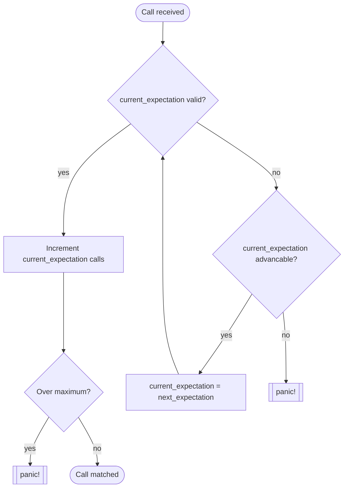

# Expectations

You can set expectations with Spies and Mocks. Here are all the ways to do that.

```rust
// Expect at least one call with (2)
spy.expect(eq(2));
// The same but as a function
spy.expectf(|id: &i32| id == 2);

// Expect (2) exactly three times.
spy.expect(eq(2)).times(3);
// Expect (2) one to three times.
spy.expect(eg(2)).times(1..=3)
// Expect (2) at least one time
spy.expect(eq(2)).times(1..);
// Expect (2) less than three time
spy.expect(eq(2)).times(..3);
// Expect (2) once
spy.expect(eq(2)).once();
// Expect (2) never
spy.expect(eq(2)).never();
```

## Global times

If you want to assert the number of calls independently of the used arguments, you can do that.

```rust
// Expect fetch_user to be called exactly 2 times.
spy.expect_times(2);
// Expect fetch_user to be called once
spy.expect_once();
// Expect fetch_user to be never called
spy.expect_never();
// Expect fetch_user to be called 2 or more times.
spy.expect_times(2..);
```

This is completely seperate from the other expectations and does not affect the sequence.

## No Sequence

```rust
// Expect (2) exactly three times.
spy.expect(eq(2)).times(3);
// Expect (2) one to three times.
spy.expect(eg(5)).times(1..=3)
```

Both expectations set like above would need to be fulfilled independently from each other. So three calls with (2) and one to three with (5).

## Sequences

```rust
let seq = Sequence::new();
// Expect (2) exactly three times.
spy.expect(eq(2)).times(3).in_sequence(&seq);
// And after that (5) one time
spy.expect(eq(5)).once().in_sequence(&seq);
```

Sequences allow you to set a sequence in which the calls need to be made.

```rust
let seq = Sequence::new();
// The sequence can be advanced at any time. No minimum or maximum of calls.
spy.expect(eq(2)).in_sequence(&seq);
// One call with (3) advances the sequence
spy.expect(eq(3)).once().in_sequence(&seq);
// Before the next step there can be no call with (4). Advancable at any time.
spy.expect(eq(4)).never().in_sequence(&seq);
// After one call with (5) advancable. If four or more calls panic.
spy.expect(eq(5)).times(1..4).in_sequence(&seq);
// After two calls with (6) advancable.
spy.expect(eq(6)).times(2..).in_sequence(&seq);
// Advancable at any time. Panics after three calls with (7).
spy.expect(eq(7)).times(..3).in_sequence(&seq);
```

There can be multiple sequences independently from each other.

### Matching algorithm



- Sequencing is **greedy**: a sequenced expectation is matched as early as
  possible. If an earlier expectation can still accept calls, it will
  consume them even if a later, more specific expectation exists — this can
  starve later expectations of calls they needed.
- A `.times(a..b)` range inside a sequence must have its **minimum**
  satisfied - become **advancable** - before the sequence can advance to the next entry.
