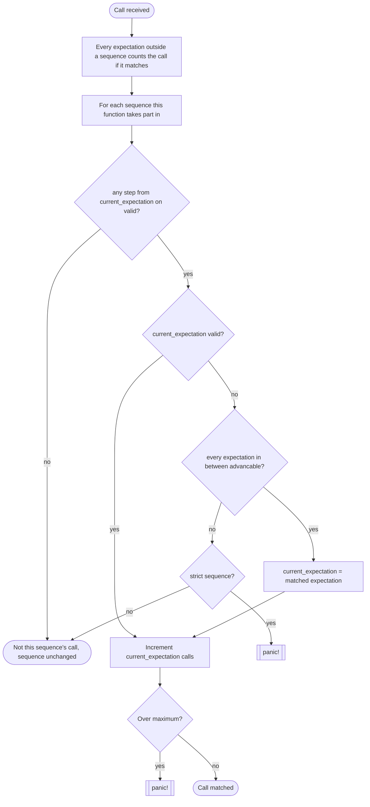

# Features

The full reference for `#[fnmock::mockable]`, fnmock's main attribute. A **mock** lets a test
replace what a function returns **and** assert on how it was called, through one accessor.

The two single-purpose attributes are each one half of a mock. Each has a short page covering only
where it differs:

- [`#[fnmock::fakeable]`](FAKE.md) is the replacing half on its own.
- [`#[fnmock::spyable]`](SPY.md) is the recording half on its own, and the real body
  always runs.

> For everything fnmock supports and rejects — parameter types and patterns, return types,
> generics, impl blocks, visibility, isolation — see the **[LIMITATIONS.md](LIMITATIONS.md)**
> matrix.

Every claim links to the test that backs it. Run the whole set with `cargo test -p fnmock-tests`.
The mock-specific interactions live in [`fnmock-tests/src/mock/`](../fnmock-tests/src/mock/). The
test files under [`fnmock-tests/src/spy/`](../fnmock-tests/src/spy/),
[`fnmock-tests/src/fake/`](../fnmock-tests/src/fake/) and
[`fnmock-tests/src/common/`](../fnmock-tests/src/common/) each have a `mod mock` that runs the same
tests through `#[mockable]`.

## Contents

- [The attribute](#the-attribute)
- [The accessor](#the-accessor)
- [Accessor methods](#accessor-methods)
- [Record first, then the fake](#record-first-then-the-fake)
- [The fake closure](#the-fake-closure)
- [Expectations](#expectations)
- [Global times](#global-times)
- [When `.expect()` is unavailable](#when-expect-is-unavailable)
- [Matching rules](#matching-rules)
- [Sequences](#sequences)
- [`clear()` resets the whole mock](#clear-resets-the-whole-mock)
- [Generics](#generics)
- [Impl blocks](#impl-blocks)
- [What a mock rejects](#what-a-mock-rejects)

## The attribute

Apply `#[fnmock::mockable]` to a free function or an inherent impl block. It:

1. injects a `#[cfg(test)]` block at the top of the original body. The block records the call,
   then returns the fake's result if a fake is installed. Otherwise the real body runs.
2. generates an accessor named `<fn_name>_mock()`. See [The accessor](#the-accessor) below.
3. generates a hidden module that holds the fake and the expectations in `thread_local!` storage.
   Nothing set up on one thread is visible on another. See [Isolation](LIMITATIONS.md#isolation).

```rust
#[fnmock::mockable]
fn fetch_user_name(id: u32) -> String {
    // real database call
}

fn greet(id: u32) -> String {
    format!("Hello, {}", fetch_user_name(id))
}

#[test]
fn test_greeting() {
    let mock = fetch_user_name_mock();
    mock.setup(|_| "Test".into());
    mock.expect(fnmock::predicate::eq(1)).once();

    assert_eq!(greet(1), "Hello, Test");

    mock.assert();
}
```

The injected block is `#[cfg(test)]`-gated, so non-test builds have no mock code and no runtime
overhead.

## The accessor

The accessor has the same visibility as the function it mocks. Its shape depends on the item:

| Item | How you call the accessor | Test |
| --- | --- | --- |
| Free function `f` | `f_mock()` | [by_value.rs](../fnmock-tests/src/common/params/by_value.rs) |
| Generic function `f<T>` | `f_mock::<T>()` | [single_generic.rs](../fnmock-tests/src/common/generics/single_generic.rs) |
| Method `m` on `Type` | `Type::m_mock()` | [basic.rs](../fnmock-tests/src/common/impl_block/basic.rs) |
| Method `m` on generic `Type<G>`, itself generic over `M` | `Type::<G>::m_mock::<M>()` | [generic_combined.rs](../fnmock-tests/src/common/impl_block/generics/generic_combined.rs) |

The accessor returns a zero-sized value. You can call it once and keep the value, as the examples
here do, or call it again each time you need it. Both reach the same state.

## Accessor methods

| Method | Behaviour | Test |
| --- | --- | --- |
| `setup(closure)` | Install a fake. Calling it again replaces the previous one. See [The fake closure](#the-fake-closure). | [record_then_fake.rs](../fnmock-tests/src/mock/record_then_fake.rs), [clear_and_is_set.rs](../fnmock-tests/src/fake/clear_and_is_set.rs) |
| `is_set()` | Whether a fake is currently installed. | [clear_and_is_set.rs](../fnmock-tests/src/fake/clear_and_is_set.rs), [generics.rs](../fnmock-tests/src/mock/generics.rs) |
| `expect(predicate, …)` | Expect calls matching one [`Predicate`](https://docs.rs/predicates) per parameter. Returns a handle. Not available on every signature: see [below](#when-expect-is-unavailable). | [times.rs](../fnmock-tests/src/spy/expectations/times.rs) |
| `expectf(closure)` | The same, but matching with a `Fn(&P1, &P2, …) -> bool` closure. Always available. | [expectf.rs](../fnmock-tests/src/spy/expectations/expectf.rs) |
| `expect_times(range)` | Expect a total call count, regardless of arguments. | [global_times.rs](../fnmock-tests/src/spy/expectations/global_times.rs) |
| `expect_once()` / `expect_never()` | Shorthand for `expect_times(1)` / `expect_times(0)`. | [global_times.rs](../fnmock-tests/src/spy/expectations/global_times.rs) |
| `assert()` | Panic unless every expectation on this mock is fulfilled. | [times.rs](../fnmock-tests/src/spy/expectations/times.rs), [assert_scoped_to_instantiation.rs](../fnmock-tests/src/spy/generics/assert_scoped_to_instantiation.rs) |
| `clear()` | Reset the **whole** mock. See [below](#clear-resets-the-whole-mock). | [clear.rs](../fnmock-tests/src/mock/clear.rs) |

The handle returned by `expect` / `expectf` takes the rest of the expectation settings: `times`,
`once`, `never`, `describe` and `in_sequence`. They are covered in [Expectations](#expectations) and
[Sequences](#sequences).

## Record first, then the fake

A mock records **every** call, including calls a fake answers. A test can therefore return a
canned value *and* assert on how the function was called.

- A faked call is recorded, and expectations match it:
  [test_faked_call_is_recorded_and_matches_expectation](../fnmock-tests/src/mock/record_then_fake.rs).
- A faked call that misses an expectation still makes `assert()` fail:
  [test_faked_call_that_misses_the_expectation_fails_assert](../fnmock-tests/src/mock/record_then_fake.rs).
- When no fake is installed, the call runs the real body and is recorded as well:
  [test_unfaked_call_runs_real_body_and_is_recorded](../fnmock-tests/src/mock/record_then_fake.rs).
- The fake receives the same arguments the expectation matched:
  [test_fake_receives_the_arguments_the_expectation_matched](../fnmock-tests/src/mock/record_then_fake.rs).

**Keep this caveat in mind:** when a fake answers a call, the real body never runs, so its side
effects don't happen
([test_faked_call_skips_real_body](../fnmock-tests/src/mock/record_then_fake.rs)).

Setting up expectations without calling `setup` is fine: the real body runs and the calls are still
recorded. Calling `setup` without setting expectations is fine too: `assert()` then passes
trivially.

## The fake closure

The closure passed to `setup` mirrors the function signature: same parameters, same return type.

- For methods, the receiver is passed as the **first** closure argument (`|_, a, b|`): [basic.rs](../fnmock-tests/src/common/impl_block/basic.rs).
- For `async` functions, the closure is a plain **synchronous** closure that returns the output
  type, not a future:
  [async_function.rs](../fnmock-tests/src/common/special/async_function.rs).
- The closure may capture state, for example an `Rc<Cell<_>>` it updates, because it is stored per
  thread and never has to be `Send`:
  [captured_state.rs](../fnmock-tests/src/fake/captured_state.rs).
- The closure may call back into its own accessor (`setup`, `is_set`, `clear`, …) without a
  double-borrow panic. A call made from inside the closure is recorded like any other:
  [reentrant_fake.rs](../fnmock-tests/src/fake/reentrant_fake.rs),
  [clear.rs](../fnmock-tests/src/mock/clear.rs).
- For a const generic parameter, the closure doesn't receive the value. The fake only applies to
  that one value, so hardcode it:
  [single_const_generic.rs](../fnmock-tests/src/common/generics/const_generics/single_const_generic.rs).

## Expectations

```rust
// Expect at least one call with (2)
mock.expect(eq(2));
// The same, written as a closure
mock.expectf(|id: &i32| *id == 2);

// Expect (2) exactly three times.
mock.expect(eq(2)).times(3);
// Expect (2) one to three times.
mock.expect(eq(2)).times(1..=3);
// Expect (2) at least one time
mock.expect(eq(2)).times(1..);
// Expect (2) fewer than three times
mock.expect(eq(2)).times(..3);
// Expect (2) once
mock.expect(eq(2)).once();
// Expect (2) never
mock.expect(eq(2)).never();
```

See [times.rs](../fnmock-tests/src/spy/expectations/times.rs) for every `times`/`once`/`never`
form above, [expectf.rs](../fnmock-tests/src/spy/expectations/expectf.rs) for `expectf`, and
[predicates.rs](../fnmock-tests/src/spy/expectations/predicates.rs) for the predicate builders.

Arguments are matched by shared reference, so nothing is cloned or moved out of the call. A `&T`
parameter has its reference stripped, so a `&str` parameter is matched by a `Predicate<str>`
([generic_reference_param.rs](../fnmock-tests/src/spy/generics/generic_reference_param.rs)).

## Global times

To assert the number of calls independently of the arguments, use `expect_times` and its
shorthands:

```rust
// Expect fetch_user to be called exactly 2 times.
mock.expect_times(2);
// Expect fetch_user to be called once
mock.expect_once();
// Expect fetch_user to never be called
mock.expect_never();
// Expect fetch_user to be called 2 or more times.
mock.expect_times(2..);
```

See [global_times.rs](../fnmock-tests/src/spy/expectations/global_times.rs) for the forms above.

These counts are separate from the argument-matching expectations set with `expect` / `expectf`,
and they don't affect sequences:
[test_global_times_does_not_affect_a_sequence](../fnmock-tests/src/spy/expectations/global_times.rs).

## When `.expect()` is unavailable

`.expect()` takes real predicates only when **no** recorded parameter type still names a lifetime
after references are stripped and elision is applied. Otherwise it is generated as a
`#[deprecated]`, zero-argument stub that panics.

Both cases are tested in
[expect_availability.rs](../fnmock-tests/src/spy/expectations/expect_availability.rs).

| | Signature shape | Example |
| --- | --- | --- |
| ✅ | No lifetime in the signature | `fn f(id: i32)` |
| ✅ | A plain reference, named or elided | `fn f<'a>(s: &'a str)`, `fn f(s: &str)` |
| ✅ | A generic instantiation without a lifetime | `fn f<T: 'static>(v: T)` |
| ✅ | A receiver whose type carries a lifetime (receivers are skipped before the check): [`test_lifetime_bearing_receiver_does_not_disable_expect`](../fnmock-derive/src/scheme/spy/impl_block/mod.rs) | `fn f(self: Pin<&mut Self>)` |
| ❌ | A lifetime-parameterised type by value | `fn f(r: Ref<'_>)` |
| ❌ | A reference to one | `fn f(r: &Ref<'_>)` |
| ❌ | A lifetime mixed with a generic | `fn f<'a, T: 'static>(r: Ref<'a>, v: T)` |
| ❌ | Multiple named lifetimes | `fn f<'a, 'b>(l: Ref<'a>, r: Ref<'b>)` |
| ❌ | A reference nested in a slice | `fn f<'a>(items: &'a [&'a str])` |

Only `.expect()` is affected. `setup`, `expectf`, `expect_times`, `expect_once`, `expect_never` and
`assert` keep working, and an `expectf`-based expectation can still take part in a sequence
([lifetime_expectf_in_sequence.rs](../fnmock-tests/src/spy/lifetimes/lifetime_expectf_in_sequence.rs)).

## Matching rules

Expectations set outside a sequence are independent of each other, and each must be fulfilled on
its own:

```rust
// Expect (2) exactly three times.
mock.expect(eq(2)).times(3);
// Expect (5) one to three times.
mock.expect(eq(5)).times(1..=3);
```

Together these need three calls with `(2)` and one to three calls with `(5)`. They don't share
calls or counts. See
[multiple_independent_expectations.rs](../fnmock-tests/src/spy/expectations/multiple_independent_expectations.rs).

| Rule | Test |
| --- | --- |
| A call that matches no expectation is **not** an error. Expectations only constrain the calls the test asked about. | [unexpected_call_is_not_an_error.rs](../fnmock-tests/src/spy/expectations/unexpected_call_is_not_an_error.rs) |
| Multiple expectations on one mock are fulfilled independently of each other. | [multiple_independent_expectations.rs](../fnmock-tests/src/spy/expectations/multiple_independent_expectations.rs) |
| `expect_times` and its shorthands are counted separately from argument-matching expectations, and they don't affect sequences. | [global_times.rs](../fnmock-tests/src/spy/expectations/global_times.rs) |
| `describe(name)` renames an expectation in failure output without changing what it matches. | [describe.rs](../fnmock-tests/src/spy/expectations/describe.rs) |
| The `self` receiver is **not** recorded and can't be matched on. Only the remaining parameters are. | [impl_block.rs](../fnmock-tests/src/mock/impl_block.rs) |

## Sequences

```rust
let seq = Sequence::new();
// Expect (2) exactly three times.
mock.expect(eq(2)).times(3).in_sequence(&seq);
// And after that (5) one time
mock.expect(eq(5)).once().in_sequence(&seq);
```

A sequence sets the order in which calls have to be made. See
[basic_order.rs](../fnmock-tests/src/spy/sequences/basic_order.rs). A faked call takes its step in
a sequence like any other call ([sequences.rs](../fnmock-tests/src/mock/sequences.rs)).

```rust
let seq = Sequence::new();
// The sequence can move past this step at any time. No minimum or maximum number of calls.
mock.expect(eq(2)).in_sequence(&seq);
// One call with (3) lets the sequence move on
mock.expect(eq(3)).once().in_sequence(&seq);
// Until the next step, there can be no call with (4). The sequence can move past it at any time.
mock.expect(eq(4)).never().in_sequence(&seq);
// After one call with (5), the sequence can move on. A fourth call panics.
mock.expect(eq(5)).times(1..4).in_sequence(&seq);
// After two calls with (6), the sequence can move on.
mock.expect(eq(6)).times(2..).in_sequence(&seq);
// The sequence can move past this step at any time. A third call with (7) panics.
mock.expect(eq(7)).times(..3).in_sequence(&seq);
```

A step is **advanceable** once its minimum number of calls is reached, meaning the sequence can
move past it.

- A `.never()` step is advanceable immediately (its minimum is 0), so the sequence can skip it
  without it ever being called. A call arriving while it is the current step still panics:
  [never_step.rs](../fnmock-tests/src/spy/sequences/never_step.rs).
- An open-ended range like `times(2..)` becomes advanceable once its minimum is reached, like any
  other ranged step: [advancable_range.rs](../fnmock-tests/src/spy/sequences/advancable_range.rs).
- Once the sequence reaches its last step, that step stays current. Further matching calls keep
  counting against its maximum instead of being ignored:
  [last_step_stays_current.rs](../fnmock-tests/src/spy/sequences/last_step_stays_current.rs).

Several sequences can exist independently of each other. See
[multiple_independent_sequences.rs](../fnmock-tests/src/spy/sequences/multiple_independent_sequences.rs).

`in_sequence` can be chained before or after `times`, `once` and `never`. The sequence reads the
call range from the expectation whenever it needs it instead of taking a copy, so both orders mean
the same thing.

```rust
// These two are equivalent.
mock.expect(eq(2)).times(2).in_sequence(&seq);
mock.expect(eq(2)).in_sequence(&seq).times(2);
```

See [chaining_order.rs](../fnmock-tests/src/spy/sequences/chaining_order.rs).

### Across functions

A sequence can hold the expectations of **different** functions. This is the only way to require
one function to be called before another. Mocks, spies and a mix of both can share a sequence
([sequences.rs](../fnmock-tests/src/mock/sequences.rs)).

```rust
let seq = Sequence::new();
get_user_mock().expect(eq("a")).once().in_sequence(&seq);
save_user_mock().expect(eq("a")).once().in_sequence(&seq);
```

Each mock only recognises its own expectations. The other function's steps never accept its calls;
they can only block the sequence from moving on. See
[cross_function.rs](../fnmock-tests/src/spy/sequences/cross_function.rs).

### Calls out of order

A call that arrives too early is **not** an error either. A call is too early when it matches a
later step while an earlier step hasn't reached its minimum yet. The sequence can't place the call,
so it treats it like any other call that doesn't fit the current step: the call isn't recorded and
the sequence stays where it is. The order is still enforced, but only by `assert()`: the skipped
step never got its calls.

```rust
let seq = Sequence::new();
mock.expect(eq(2)).times(3).in_sequence(&seq);
mock.expect(eq(5)).once().in_sequence(&seq);

fetch_user(2);
fetch_user(5); // too early: dropped, and the sequence stays on the first step
fetch_user(2);
fetch_user(2);
// mock.assert() fails: the (5) expectation never got its call.
```

See [out_of_order_lenient.rs](../fnmock-tests/src/spy/sequences/out_of_order_lenient.rs).

To have that call panic where it happens instead, make the sequence `strict`. The order is the
same; the failure is just reported earlier and names the offending call.

```rust
let seq = Sequence::new_strict();
mock.expect(eq(2)).times(3).in_sequence(&seq);
mock.expect(eq(5)).once().in_sequence(&seq);

fetch_user(2);
fetch_user(5); // panics
```

Strictness only concerns the order of the sequence's own steps. Calls that have nothing to do with
the sequence pass a strict sequence just as they pass a lenient one. See
[strict_sequence_in_order.rs](../fnmock-tests/src/spy/sequences/strict_sequence_in_order.rs).

### Unexpected calls in a sequence

```rust
let seq = Sequence::new();
mock.expect(eq(2)).once().in_sequence(&seq);
mock.expect(eq(3)).once().in_sequence(&seq);
// Not in the sequence, so it has no order: a call with (9) can come at any
// time. It neither moves the sequence on nor counts as out of order.
mock.expect(eq(9)).times(2);

fetch_user(9); // counted by the expectation outside the sequence
fetch_user(2); // the sequence's current expectation
fetch_user(9); // fine, even though (3) is still pending
fetch_user(7); // fine: nothing expects it, and nothing complains
fetch_user(3); // moves the sequence on
```

See
[unsequenced_expectation_independent.rs](../fnmock-tests/src/spy/sequences/unsequenced_expectation_independent.rs).

### Matching algorithm



Sequencing is **greedy**: a call is matched to the earliest step that can take it. If an earlier step can still accept calls, it takes them even when a later, more specific step exists, which can leave the later step short of calls it needed: [greedy_matching.rs](../fnmock-tests/src/spy/sequences/greedy_matching.rs).

## `clear()` resets the whole mock

`clear()` returns the accessor to a freshly created state. It removes the installed fake **and**
drops every expectation, every `expect_times` range and every recorded call. It also removes the
mock's steps from any sequence.

```rust
let mock = get_user_mock();
mock.setup(|_| "Test".into());
mock.expect(eq(1)).once();

get_user(1);
mock.clear();                 // fake, expectation and call history are gone

get_user(2);                  // real body; recorded from scratch, no expectation to violate
mock.assert();                // passes
```

After `clear()`, `is_set()` is `false`, calls run the real body, and `assert()` passes trivially.
A cleared mock can be set up and given expectations again. See
[clear.rs](../fnmock-tests/src/mock/clear.rs).

You don't need `clear()` between tests: each `#[test]` runs on its own thread and gets its own
state. To swap one fake for another mid-test, call `setup` again; it replaces the fake and keeps
the expectations. There is no way to clear only half of a mock. If a test needs that, use a plain
[`#[fakeable]`](FAKE.md) or [`#[spyable]`](SPY.md), whose `clear()` only resets
its own state.

## Generics

The fake and the expectations of a generic item are both stored **per instantiation**.
`foo_mock::<i32>()` controls the fake *and* the expectations for `i32`; `foo_mock::<u8>()` is
untouched on both counts. That includes `clear()`
([generics.rs](../fnmock-tests/src/mock/generics.rs),
[test_generic_clear_resets_both_halves_of_one_instantiation_only](../fnmock-tests/src/mock/clear.rs)).

**Always write out the generic arguments** on both the accessor and the call site. If the compiler
infers different ones than you expected, nothing errors. The fake doesn't apply, the real body
runs, and the call is recorded on a different instantiation than the one you asserted on. Type
parameters must be `'static`; const parameters are keyed by value. See
[Generics](LIMITATIONS.md#generics).

## Impl blocks

Every method in an impl block gets its own independent mock, and the accessor is an associated
function, `Type::method_mock()`
([impl_block.rs](../fnmock-tests/src/mock/impl_block.rs)).

- `setup` receives the receiver as its **first** closure argument, for every receiver form
  (`&self`, `&mut self`, `self`, `Box<Self>`, `Rc<Self>`, `Pin<&mut Self>`).
- Expectations never match on the receiver; they take one predicate per remaining parameter.
- Associated functions without a receiver take neither.

Struct generics go on the type and method generics on the accessor:
`GenericService::<String>::convert_mock::<i32>()`.
