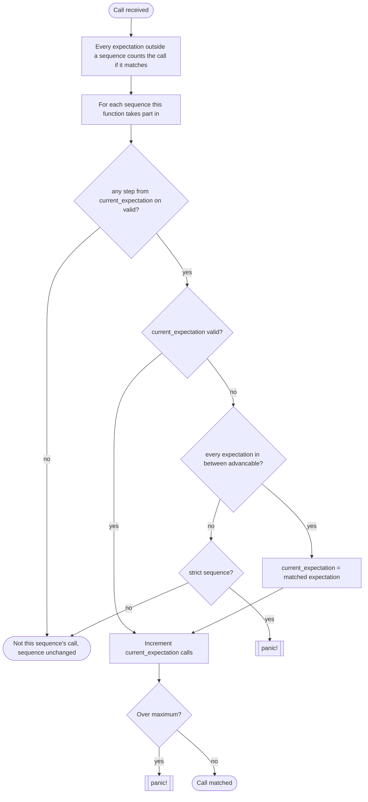

# Spy features

What is specific to `#[fnmock::spyable]`: the attribute, the `_spy()` accessor it generates, and the
expectation methods you call on it.

A **spy** observes calls without changing them: the real body always runs and returns its real
value, and the spy records which arguments it was called with so the test can assert on them. For
the replace-the-body counterpart see [FAKE_FEATURES.md](FAKE_FEATURES.md).

> For everything fnmock supports and rejects across **both** macros — parameter types and patterns,
> return types, generics, impl blocks, visibility, isolation — see the shared
> **[LIMITATIONS.md](LIMITATIONS.md)** matrix. This document only covers what is unique to spies.

Every claim links to the test that backs it. Run the whole set with `cargo test -p fnmock-tests`.
Most of these tests live in [`fnmock-tests/src/spy/`](../fnmock-tests/src/spy/); a few illustrate
the accessor shape using the `mod spy` half of a file shared with `#[fnmock::fakeable]` under
[`fnmock-tests/src/common/`](../fnmock-tests/src/common/), and one links to a unit test inside
`fnmock-derive`, for a property of the generated code that no integration test observes directly.

## Contents

- [The attribute](#the-attribute)
- [The accessor](#the-accessor)
- [Accessor methods](#accessor-methods)
- [Global times](#global-times)
- [When `.expect()` is unavailable](#when-expect-is-unavailable)
- [Matching rules](#matching-rules)
- [Sequences](#sequences)

## The attribute

Apply `#[fnmock::spyable]` to a free function or an inherent impl block. It:

1. injects a `#[cfg(test)]` call recording statement at the top of the original body — the body then
   runs unchanged, returning its real value — [basic.rs](../fnmock-tests/src/common/impl_block/basic.rs);
2. generates an accessor named `<fn_name>_spy()` — see [The accessor](#the-accessor) below;
3. generates a hidden module holding the spy's expectations in `thread_local!` storage, so
   expectations set on one thread are invisible to another —
   [thread_isolation.rs](../fnmock-tests/src/common/visibility/thread_isolation.rs).

```rust
#[fnmock::spyable]
fn fetch_user(id: i32) -> String {
    format!("user {id}")
}

#[test]
fn test() {
    let spy = fetch_user_spy();
    spy.expect(fnmock::predicate::eq(2)).once();

    assert_eq!(fetch_user(2), "user 2"); // the real body still runs

    spy.assert();
}
```

The recording is `#[cfg(test)]`-gated, so non-test builds carry no spy machinery and no runtime
overhead.

## The accessor

The accessor is emitted with the same visibility as the function it spies on. Its shape depends on
the item:

| Item | How you call the accessor | Test |
| --- | --- | --- |
| Free function `f` | `f_spy()` | [by_value.rs](../fnmock-tests/src/common/params/by_value.rs) |
| Generic function `f<T>` | `f_spy::<T>()` | [single_generic.rs](../fnmock-tests/src/common/generics/single_generic.rs) |
| Method `m` on `Type` | `Type::m_spy()` | [basic.rs](../fnmock-tests/src/common/impl_block/basic.rs) |
| Method `m` on generic `Type<G>`, itself generic over `M` | `Type::<G>::m_spy::<M>()` | [generic_combined.rs](../fnmock-tests/src/common/impl_block/generics/generic_combined.rs) |

For a generic function, each combination of generic arguments gets its own store, so **always spell
the arguments out explicitly** on both the accessor and the call site — if the compiler infers
different ones than you expected, the spy silently records nothing. See
[Generics](LIMITATIONS.md#generics) in LIMITATIONS.md.

## Accessor methods

```rust
// Expect at least one call with (2)
spy.expect(eq(2));
// The same but as a function
spy.expectf(|id: &i32| id == 2);

// Expect (2) exactly three times.
spy.expect(eq(2)).times(3);
// Expect (2) one to three times.
spy.expect(eq(2)).times(1..=3);
// Expect (2) at least one time
spy.expect(eq(2)).times(1..);
// Expect (2) less than three times
spy.expect(eq(2)).times(..3);
// Expect (2) once
spy.expect(eq(2)).once();
// Expect (2) never
spy.expect(eq(2)).never();
```

See [times.rs](../fnmock-tests/src/spy/expectations/times.rs) for every `times`/`once`/`never`
shape above, and [expectf.rs](../fnmock-tests/src/spy/expectations/expectf.rs) for `expectf`.

| Method | Behaviour | Test |
| --- | --- | --- |
| `expect(predicate, …)` | Expect calls matching one [`Predicate`](https://docs.rs/predicates) per parameter. Returns a handle. Not available on every signature — see below. | [times.rs](../fnmock-tests/src/spy/expectations/times.rs) |
| `expectf(closure)` | Same, but matching with a `Fn(&P1, &P2, …) -> bool` closure. Always available. | [expectf.rs](../fnmock-tests/src/spy/expectations/expectf.rs) |
| `expect_times(range)` | Expect a total call count, regardless of arguments. | [global_times.rs](../fnmock-tests/src/spy/expectations/global_times.rs) |
| `expect_once()` | Shorthand for `expect_times(1)`. | [global_times.rs](../fnmock-tests/src/spy/expectations/global_times.rs) |
| `expect_never()` | Shorthand for `expect_times(0)`. | [global_times.rs](../fnmock-tests/src/spy/expectations/global_times.rs) |
| `assert()` | Panic unless every expectation on this spy is fulfilled. Only checks the instantiation it was called on. | [times.rs](../fnmock-tests/src/spy/expectations/times.rs), [assert_scoped_to_instantiation.rs](../fnmock-tests/src/spy/generics/assert_scoped_to_instantiation.rs) |

There is no `clear()` or `is_set()`; a spy has no installed state to remove.

The handle returned by `expect`/`expectf` carries the rest of the DSL — `times`, `once`, `never`,
`describe`, `in_sequence` — which is documented below in [Matching rules](#matching-rules) and
[Sequences](#sequences), and covered by
[`fnmock-tests/src/spy/expectations/`](../fnmock-tests/src/spy/expectations/) and
[`fnmock-tests/src/spy/sequences/`](../fnmock-tests/src/spy/sequences/).

## Global times

If you want to assert the number of calls independently of the arguments used, `expect_times` and
its shorthands do that:

```rust
// Expect fetch_user to be called exactly 2 times.
spy.expect_times(2);
// Expect fetch_user to be called once
spy.expect_once();
// Expect fetch_user to be never called
spy.expect_never();
// Expect fetch_user to be called 2 or more times.
spy.expect_times(2..);
```

See [global_times.rs](../fnmock-tests/src/spy/expectations/global_times.rs) for the shapes above.

This is completely separate from the argument-matching expectations set with `expect`/`expectf` and
does not affect sequences —
[test_global_times_does_not_affect_a_sequence](../fnmock-tests/src/spy/expectations/global_times.rs).

## When `.expect()` is unavailable

`.expect()` is only generated as a real, predicate-based method when **no** recorded parameter type
still names a lifetime after references are stripped and elision is applied. Otherwise it is
generated as a `#[deprecated]`, zero-argument stub that panics with

```text
`.expect()` is not available on this spy; use `.expectf()` instead
```

Both halves of that split are pinned in
[expect_availability.rs](../fnmock-tests/src/spy/expectations/expect_availability.rs).

| | Signature shape | Example |
| --- | --- | --- |
| ✅ | No lifetime in the signature | `fn f(id: i32)` |
| ✅ | A plain reference, named or elided | `fn f<'a>(s: &'a str)`, `fn f(s: &str)` |
| ✅ | A generic instantiation without a lifetime | `fn f<T: 'static>(v: T)` |
| ✅ | A receiver whose type carries a lifetime (it is skipped before the check) — [`test_lifetime_bearing_receiver_does_not_disable_expect`](../fnmock-derive/src/scheme/impl_block/spy/mod.rs) | `fn f(self: Pin<&mut Self>)` |
| ❌ | A lifetime-parameterised type by value | `fn f(r: Ref<'_>)` |
| ❌ | A reference to one | `fn f(r: &Ref<'_>)` |
| ❌ | A lifetime mixed with a generic | `fn f<'a, T: 'static>(r: Ref<'a>, v: T)` |
| ❌ | Multiple named lifetimes | `fn f<'a, 'b>(l: Ref<'a>, r: Ref<'b>)` |
| ❌ | A reference nested in a slice | `fn f<'a>(items: &'a [&'a str])` |

Only `.expect()` is affected. `expectf`, `expect_times`, `expect_once`, `expect_never` and `assert`
keep working, and an `expectf`-based expectation can still take part in a sequence
([lifetime_expectf_in_sequence.rs](../fnmock-tests/src/spy/lifetimes/lifetime_expectf_in_sequence.rs)).

## Matching rules

Expectations set outside a sequence are independent of each other and must each be fulfilled on
their own:

```rust
// Expect (2) exactly three times.
spy.expect(eq(2)).times(3);
// Expect (5) one to three times.
spy.expect(eq(5)).times(1..=3);
```

Both would need three calls with `(2)` and one to three with `(5)` — they don't share calls or
counts. See
[multiple_independent_expectations.rs](../fnmock-tests/src/spy/expectations/multiple_independent_expectations.rs).

| Rule | Test |
| --- | --- |
| A call that matches no expectation is **not** an error — a spy does not replace the function, so it stays quiet about calls the test did not ask about. | [unexpected_call_is_not_an_error.rs](../fnmock-tests/src/spy/expectations/unexpected_call_is_not_an_error.rs) |
| Multiple expectations on one spy are fulfilled independently of each other. | [multiple_independent_expectations.rs](../fnmock-tests/src/spy/expectations/multiple_independent_expectations.rs) |
| `expect_times` and friends are counted separately from argument-matching expectations and do not affect sequences. | [global_times.rs](../fnmock-tests/src/spy/expectations/global_times.rs) |
| `describe(name)` renames an expectation in failure output without changing what it matches. | [describe.rs](../fnmock-tests/src/spy/expectations/describe.rs) |
| A `&T` parameter has its reference stripped, so the predicate is a `Predicate<T>`, not a `Predicate<&T>`. | [generic_reference_param.rs](../fnmock-tests/src/spy/generics/generic_reference_param.rs) |
| The `self` receiver is **not** recorded and cannot be matched on; only the remaining parameters are. | - |

## Sequences

```rust
let seq = Sequence::new();
// Expect (2) exactly three times.
spy.expect(eq(2)).times(3).in_sequence(&seq);
// And after that (5) one time
spy.expect(eq(5)).once().in_sequence(&seq);
```

Sequences allow you to set an order in which the calls need to be made — see
[basic_order.rs](../fnmock-tests/src/spy/sequences/basic_order.rs).

```rust
let seq = Sequence::new();
// The sequence can be advanced at any time. No minimum or maximum of calls.
spy.expect(eq(2)).in_sequence(&seq);
// One call with (3) advances the sequence
spy.expect(eq(3)).once().in_sequence(&seq);
// Before the next step there can be no call with (4). Advancable at any time.
spy.expect(eq(4)).never().in_sequence(&seq);
// After one call with (5) advancable. If four or more calls panic.
spy.expect(eq(5)).times(1..4).in_sequence(&seq);
// After two calls with (6) advancable.
spy.expect(eq(6)).times(2..).in_sequence(&seq);
// Advancable at any time. Panics after three calls with (7).
spy.expect(eq(7)).times(..3).in_sequence(&seq);
```

A `.never()` step is advancable immediately (its minimum is 0), so the sequence can skip past it
without it ever being called, but a call arriving while it is current still panics —
[never_step.rs](../fnmock-tests/src/spy/sequences/never_step.rs). An open-ended range like
`times(2..)` becomes advancable once its minimum is reached, the same as any other ranged step —
[advancable_range.rs](../fnmock-tests/src/spy/sequences/advancable_range.rs). Once the sequence
reaches its last step, that step stays current, so further matching calls keep being counted
against its maximum instead of being ignored —
[last_step_stays_current.rs](../fnmock-tests/src/spy/sequences/last_step_stays_current.rs).

There can be multiple sequences independent from each other —
[multiple_independent_sequences.rs](../fnmock-tests/src/spy/sequences/multiple_independent_sequences.rs).

`in_sequence` may be chained before or after `times`, `once` and `never` — the sequence reads the
call range off the expectation whenever it needs it instead of taking a copy, so both orders
describe the same thing.

```rust
// These two are equivalent.
spy.expect(eq(2)).times(2).in_sequence(&seq);
spy.expect(eq(2)).in_sequence(&seq).times(2);
```

See [chaining_order.rs](../fnmock-tests/src/spy/sequences/chaining_order.rs).

### Across functions

A sequence may hold the expectations of **different** spied functions, which is the only way to say
that one function has to be called before another.

```rust
let seq = Sequence::new();
get_user_spy().expect(eq("a")).once().in_sequence(&seq);
save_user_spy().expect(eq("a")).once().in_sequence(&seq);

// Calling save_user first panics.
```

Each spy only recognises its own expectations, so the steps of the other function never accept its
calls — they can only block it from advancing. See
[cross_function.rs](../fnmock-tests/src/spy/sequences/cross_function.rs).

### Calls out of order

A call that arrives too early — one that matches a later step while an earlier one has not reached
its minimum yet — is **not** an error either. The sequence cannot place it, so it handles it like
any other call that does not apply to the current step: it is not recorded and the sequence stays
where it is. The order is still enforced, only at the assert: the step that was passed over never
got its calls.

```rust
let seq = Sequence::new();
spy.expect(eq(2)).times(3).in_sequence(&seq);
spy.expect(eq(5)).once().in_sequence(&seq);

fetch_user(2);
fetch_user(5); // too early: dropped, the sequence stays on the first step
fetch_user(2);
fetch_user(2);
// spy.assert() fails: the (5) expectation never got its call.
```

See [out_of_order_lenient.rs](../fnmock-tests/src/spy/sequences/out_of_order_lenient.rs).

Set `strict` on the sequence to have that call panic where it happens instead. It is the same
order, only reported earlier and with the offending call named.

```rust
let seq = Sequence::new().strict();
spy.expect(eq(2)).times(3).in_sequence(&seq);
spy.expect(eq(5)).once().in_sequence(&seq);

fetch_user(2);
fetch_user(5); // panics
```

Strictness only concerns the order of the sequence's own steps. See
[strict_sequence_in_order.rs](../fnmock-tests/src/spy/sequences/strict_sequence_in_order.rs). Calls the sequence has nothing to
do with pass a strict sequence just like a lenient one.

### Unexpected calls in a sequence

```rust
let seq = Sequence::new();
spy.expect(eq(2)).once().in_sequence(&seq);
spy.expect(eq(3)).once().in_sequence(&seq);
// Not in the sequence, so it is not ordered: a call with (9) may come at any
// time, and it neither advances the sequence nor counts as out of order.
spy.expect(eq(9)).times(2);

fetch_user(9); // counted by the unsequenced expectation
fetch_user(2); // the sequence's current expectation
fetch_user(9); // fine, even though (3) is still pending
fetch_user(7); // fine, nothing expects it and nothing complains
fetch_user(3); // advances the sequence
```

See
[unsequenced_expectation_independent.rs](../fnmock-tests/src/spy/sequences/unsequenced_expectation_independent.rs).

### Matching algorithm



- Sequencing is **greedy**: a sequenced expectation is matched as early as possible. If an earlier
  expectation can still accept calls, it will consume them even if a later, more specific
  expectation exists — this can starve later expectations of calls they needed —
  [greedy_matching.rs](../fnmock-tests/src/spy/sequences/greedy_matching.rs).
- A `.times(a..b)` range inside a sequence must have its **minimum** satisfied — become
  **advancable** — before the sequence can advance past it —
  [advancable_range.rs](../fnmock-tests/src/spy/sequences/advancable_range.rs).
- A call that would need the sequence to advance past an expectation that is not advancable yet is
  dropped, and only a `strict` sequence panics on it —
  [out_of_order_lenient.rs](../fnmock-tests/src/spy/sequences/out_of_order_lenient.rs),
  [strict_sequence_in_order.rs](../fnmock-tests/src/spy/sequences/strict_sequence_in_order.rs).
- A call **no** step of a sequence accepts leaves that sequence untouched. That is what keeps two
  sequences, the calls of another spied function, and expectations set outside any sequence
  independent of each other. This holds for `strict` sequences too — strictness is only about the
  order of its own steps —
  [multiple_independent_sequences.rs](../fnmock-tests/src/spy/sequences/multiple_independent_sequences.rs),
  [unsequenced_expectation_independent.rs](../fnmock-tests/src/spy/sequences/unsequenced_expectation_independent.rs).
- The last step stays current once it is reached, so calls matching it keep being counted against
  its maximum —
  [last_step_stays_current.rs](../fnmock-tests/src/spy/sequences/last_step_stays_current.rs).
