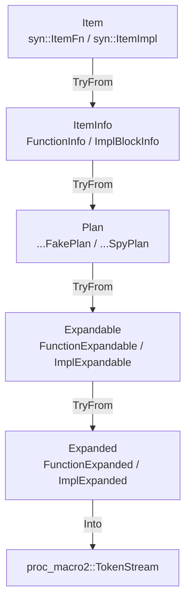

# fnmock-derive

Proc-macro implementation of `#[fakeable]` and `#[spyable]` for the
[`fnmock`](../fnmock) crate. This crate has no stable API of its own —
depend on `fnmock`, which re-exports both attributes.

## Pipeline

Each attribute expansion runs through `strategy::execute::<S: Strategy>`,
a fixed chain of `TryFrom` conversions defined by the `Strategy` trait
(`src/strategy/mod.rs`):



Four zero-sized `Strategy` impls pick the concrete types at each stage,
one per (item kind × double kind): `FunctionFakeStrategy`,
`FunctionSpyStrategy`, `ImplFakeStrategy`, `ImplSpyStrategy`.

## Structure

```
src/
├── lib.rs                 #[fakeable] / #[spyable] entry points
├── fakeable.rs, spyable.rs   dispatch into strategy::execute
├── strategy/               Strategy trait + the four concrete strategies
├── item_info/               stage 1: extraction from syn AST (implemented)
├── plan/                    stage 2: planning
├── expandable/               stage 3: expandable form
└── expanded/                 stage 4: final TokenStream
```

Each stage directory is split by item kind (`function/`, `impl_block/`)
and, where the type differs, by double kind (`fake/`, `spy/`).
