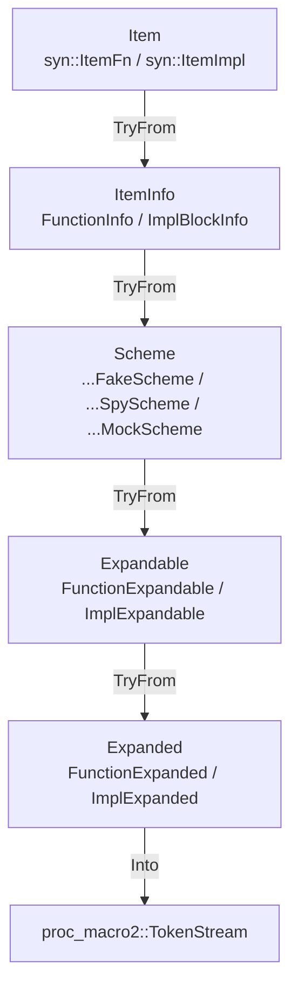

# fnmock-derive

Proc-macro implementation of `#[fakeable]`, `#[spyable]` and `#[mockable]` for the
[`fnmock`](../fnmock) crate. This crate has no stable API of its own —
depend on `fnmock`, which re-exports the attributes.

## Pipeline

Each attribute expansion runs through `strategy::execute::<S: Strategy>`,
a fixed chain of `TryFrom` conversions defined by the `Strategy` trait
(`src/strategy/mod.rs`):



Six zero-sized `Strategy` impls pick the concrete types at each stage,
one per (item kind × double kind): `FunctionFakeStrategy`,
`FunctionSpyStrategy`, `FunctionMockStrategy`, `ImplFakeStrategy`,
`ImplSpyStrategy`, `ImplMockStrategy`. A mock composes the fake and spy
halves rather than reimplementing them; see
[ARCHITECTURE.md](../docs/internal/ARCHITECTURE.md).

## Structure

```
src/
├── lib.rs                 #[fakeable] / #[spyable] / #[mockable] entry points
├── entry.rs                 dispatch: item kind -> strategy::execute
├── fakeable.rs, spyable.rs, mockable.rs   name the two strategies to dispatch to
├── strategy/               Strategy trait + the six concrete strategies
├── item_info/               stage 1: extraction from syn AST (implemented)
├── scheme/                  stage 2: scheme (identifiers/module layout to generate)
├── expandable/               stage 3: expandable form
└── expanded/                 stage 4: final TokenStream
```

Each stage directory is split by item kind (`function/`, `impl_block/`)
and, where the type differs, by double kind (`fake/`, `spy/`, `mock/`).

## Generics

Generics are passed by an Option, since they are not always present and change how the macro behaves. If the Option is `Some`, the implementations will assume the generics are present. `item_info` makes sure, that the generics are present, if the Option is `Some`.
